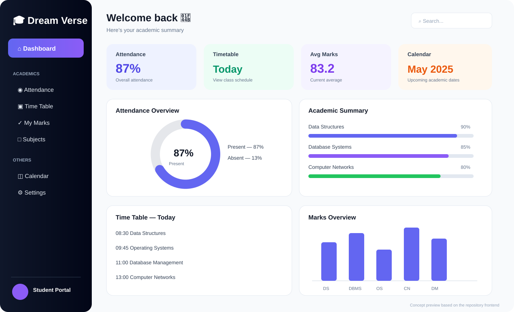

# 🎓 Student Dashboard

A full-stack academic dashboard built with **React + Vite** on the frontend and **Node.js + Express + MongoDB** on the backend. The application provides students with a central place to view academic information such as attendance, marks, timetable data, and visual summaries.

## 🖼️ Project Preview

The preview below is a **frontend-based concept preview** created from the components and styling present in this repository. It is intended to show how the dashboard experience is structured; it is not a captured screenshot of a running deployment.



## ✨ Features

- Student login and faculty login flows
- Student dashboard with academic summary cards
- Attendance information
- Marks and average-score information
- Timetable view
- Calendar area
- Data visualizations using Recharts
- Sidebar-based dashboard navigation
- Backend API communication through Axios
- MongoDB persistence through Mongoose

## 🏗️ Application Structure

```text
Student
   │
   ▼
React + Vite Frontend
   │
   │ Axios / HTTP
   ▼
Express Backend
   │
   │ Mongoose
   ▼
MongoDB
```

## 🧩 Frontend

The frontend is organized around reusable React components including:

- `Login` — student authentication entry point
- `FacultyLogin` — faculty authentication entry point
- `Dashboard` — student academic overview
- `Marks` — marks information
- `Attendance` — attendance information
- `Timetable` — class schedule
- `Sidebar` — dashboard navigation
- `Charts` — academic data visualization

The main dashboard presents the student's summary and provides navigation to attendance, timetable, and marks sections. fileciteturn155file0L2-L6

## ⚙️ Backend

The backend provides the API layer used by the frontend and connects to MongoDB using Mongoose.

**Stack:**

- Node.js
- Express 5
- MongoDB
- Mongoose
- CORS
- dotenv
- Nodemon

## 🛠️ Technology Stack


## 🚀 Run Locally

### 1. Start the backend

```bash
cd backend
npm install
npm run dev
```

### 2. Start the frontend

```bash
cd frontend
npm install
npm run dev
```

Configure the required backend environment variables in a local `.env` file. Keep database credentials and other secrets out of Git.

## 📁 Project Structure

```text
.
├── frontend/
│   ├── public/
│   └── src/
│       ├── components/
│       ├── App.jsx
│       └── ...
├── backend/
│   └── ...
├── docs/
│   └── student-dashboard-preview.svg
└── README.md
```

## 🎯 What This Project Demonstrates

- Full-stack web application development
- React component-based UI design
- REST API integration
- MongoDB database connectivity
- Academic data visualization
- Frontend/backend separation
- Authentication-oriented application flows

## 📌 Status

Development / learning project.

## 👨‍💻 Author

**Dreamjain**
