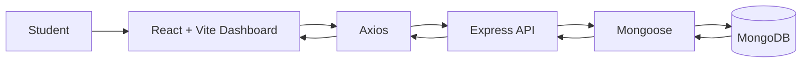

# 🎓 Student Dashboard

A full-stack student dashboard project with a **React + Vite frontend** and a **Node.js + Express + MongoDB backend**. The frontend includes data visualization components and communicates with the backend through HTTP requests.

## 🖼️ Architecture



## ✨ Key Areas

### Frontend
- React-based dashboard interface
- Vite development/build tooling
- Axios for API communication
- React Icons for interface icons
- Recharts for data visualization

### Backend
- Express HTTP server
- CORS configuration
- Dotenv environment configuration
- Mongoose for MongoDB access
- Nodemon for development

## 🧰 Technology


## 🚀 Run Locally

### Backend

```bash
cd backend
npm install
npm run dev
```

### Frontend

```bash
cd frontend
npm install
npm run dev
```

Configure the backend's environment variables in a local `.env` file as required by the application. Do not commit database credentials or other secrets.

## 📁 Structure

```text
.
├── frontend/   # React + Vite dashboard
└── backend/    # Express + MongoDB API
```

## 📌 Status

Development / learning project.

## 👨‍💻 Author

**Dreamjain** — [GitHub](https://github.com/Dreamjain)
